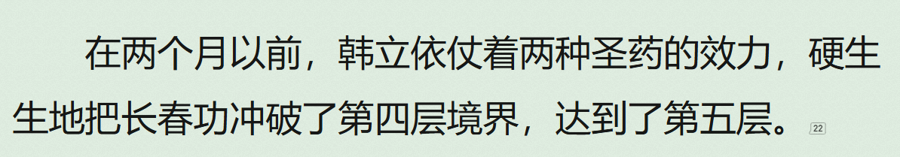

# 时间线

## 韩立 10 岁

### 时间锚定

- 韩立一家七口人，有两个兄长，一个姐姐，还有一个小妹，他在家里排行老四，今年刚十岁，家里的生活很清苦，一年也吃不上几顿带荤腥的饭菜，全家人一直在温饱线上徘徊着。

### 修为

- 凡人

### 第一章 山边小村

- 三叔韩胖子介绍准备参加七玄门内门弟子选拔测试

### 第二章 青牛镇

- 韩立临时落脚青牛镇，等待七玄门的人来接他去参加选拔

### 第三章 七玄门

- 韩立和其他参加选拔的同伴一起到达七玄门，等待选拔

### 第四章 炼骨崖

- 韩立和其他人一起参加入门选拔，未通过，但和张铁一起作为记名弟子被留下
- 一天

### 第五章 墨大夫

- 韩立和张铁被墨大夫领去神手谷去做炼药童子和采药弟子

### 第六章 无名口诀

- 韩立和张铁接受墨大夫安排，接下来的一个月和其他童子识文断字，学习医药、武学等基础知识
- 一个月后，墨大夫传授给韩立和张铁修身养性的口诀，半年后要考核

### 第七章 修炼难

- 韩立通过半年的苦修，对于长生经终于入门并突破到第一层
- 张铁始终没有入门长生经
- 半年

### 第八章 入门弟子

- 韩立因长生经练到第一层被墨大夫收为入门弟子
- 张铁被传授其他功夫也留在了神手谷

### 第九章 象甲功

- 韩立继续修炼长生经，墨大夫不准其分心其他事情
- 张铁被传授象甲功，此功比较难练

### 第十章 神秘瓶子

- 韩立在去往张铁练功的瀑布途中，脚踢到一个神秘瓶子，致使脚大拇指受伤
- 时间节点大概为秋天

### 第十一章 瓶难开

- 韩立尝试打开神秘瓶子，未打开
- 韩立找张铁也尝试打开瓶子，未打开
- 韩立打算尝试其他办法开瓶

### 第十二章 砸瓶子

- 韩立尝试了用手、锤子等暴力手段砸开瓶子，瓶子毫发未损，所以觉着是个好东西

### 第十三章 异象起

- 韩立脚受伤，张铁陪伴照顾
- 韩立在有月亮的情况下发下神秘瓶子的异象

## 韩立 12 岁

### 时间锚点

- 另一位师兄兼好友张铁，在两年前练成“象甲功”第三层时，就突然消失了。只留下一封告辞、要去闯江湖的书信，这在整个七玄门引起了一阵轩然大波。后来听说，是墨大夫出头求情，这才没有连累到他的推荐人和家里亲戚。这让韩立觉得太突然了，难过了好几天，稍后想想，隐隐觉得不太对劲，但他人小言微，也没人询问他，这件事也就不了了之了。后来，韩立猜想，张铁莫不是害怕“象甲功”第四层的修炼，才不知不觉、偷偷地溜掉。（第十五章 四年后）

### 修为

- 炼气二层

### 张铁

- 在韩立苦修长生经期间，张铁练成象甲功第三层后消失了，留信说是闯荡江湖
- 墨大夫求情没有牵连张铁的推荐人和家人
- 韩立有点难过，事后察觉到事情不对劲

## 韩立 14 岁

### 时间锚点

- 一晃的时间，四年过去了，韩立已十四岁了。（第十四章 神秘液）

### 修为

- 炼气三层

### 第十四章 神秘液

- 韩立连续测试七天，在第八天发现瓶子可以打开，里面生成了一滴，等待无聊时继续研究
- 韩立自从通过入门测试后就不上心修炼长生经，墨大夫用每修炼成功一层就多加银钱份例鼓励使其重新头去苦修
- 随着功夫进步感官变得愈发敏锐

### 第十五章 四年后

- 墨大夫病情严重，督促韩立练功愈发严厉
- 韩立对墨大夫渐渐起了防范之心
- 韩立自从长生经练成第三层以后，一年内都已经没有进步了，墨大夫准备下山为韩立找寻药材
- 墨大夫下山
- 韩立走出神手谷，到处散心

### 第十六章 小算盘

- 韩立观看同门较技

### 第十七、八章 厉师兄

- 厉飞羽初登场

### 第十九章 抽髓丸

- 韩立遇见厉飞羽服用抽髓丸发作，救治

### 第二十章 止痛药

- 厉飞羽对救命恩人用刀威胁
- 韩立反思并以后不再随意出手救人
- 俩人相识

### 第二十一章 心魔生

- 韩立为厉飞羽配药一年量
- 韩立思念亲人，觉得渐渐疏远，产生了心魔
- 通过韩母求来的平安符化解
- 长生经突破到第三层顶峰

### 第二十二章 试药兔

- 韩立将神秘绿液掺入一些普通的清水，喂给多个兔子，栓在药田旁
- 兔子膨胀变大爆炸，视为蛇蝎一样的瓷碗扔到了一边的药田地里
- 给厉飞羽送药
- 药田里面被神秘绿液浇灌过的药草留待观察

### 第二十三章 到 第二十七章

- 忽然发现被神秘绿液浇灌的药草药龄增长
- 测试掌天瓶是否还会产生神秘绿液
- 重新使用兔子测试由神秘绿液催熟的药草是否有毒
- 发现神秘绿液的产生和功效
- 配药修炼突破到第四层，并为了防范墨大夫，提前催熟大量药草，配置了大量丹药以供后续修炼使用
- 第四层产生神识，五感体质质变

## 韩立 15 岁

### 时间锚点

- 现在离墨大夫下山已经过了近半年，估计他再有六七个月就该回到了七玄门。在他回来之前的这些日子里，韩立只有尽可能地多催生一些对自己有用的草药，要有计划地按照他知道的几个珍稀配方来获取药材，不能盲目地乱浪费这些绿液。（第二十七章 配灵药）

### 修为

- 炼气四层
- 墨回谷，两个月后，炼气五层（第三十四章 眨眼剑法）

### 墨大夫 37 岁

### 第二十八章 到 第三十二章

- 墨大夫回谷，墨大夫油尽灯枯状态，寿命快要到了
- 墨大夫带回了曲魂，检查韩立练功进度
- 韩立伪装在第三层，墨大夫不满意韩立练功进度，师徒爆发冲突
- 墨大夫逼韩立付下尸虫丸，督促韩立尽快突破第四层，用于救治自己

### 第三十三章 到 第四十章

- 韩立与厉飞羽私下学习眨眼剑法和罗烟步等武技，增强与墨大夫摊牌的底牌
- 门内铁匠铺制作短剑和其他器物
- 向厉飞羽告知门内有奸细

### 第四十一章 到 第四十三章

- 韩立留书独自修炼长春功和相关武技，四五月后与墨大夫摊牌
- 墨大夫派云翅鸟监视韩立，被其发现但不理会
- 期间，厉飞羽利用情报立功，成为护法

## 韩立 16 岁

### 时间锚点

- 依据内容推算

### 修为

- 炼气六层

### 第四十四章 到 第五十一章

- 韩立如约与墨大夫摊牌，期间经过各种斗争失败被曲魂控制
- 韩立修为在炼气六层

### 第五十二章 到 第五十七章

- 墨大夫使用七鬼噬魂大法塑造出了自己的元神，并恢复了自己的身体，使其恢复到三十多岁，是个美男子
- 墨大夫使用定神符使韩立不能动弹，将韩立转移到密室中
- 墨大夫最后与余子童确定夺舍的一切是否有问题，也将两人的最终目的暴露在韩立面前，毫不掩饰
- 墨大夫、余子童先后夺舍韩立失败，余子童舍弃部分元神逃出了韩立的上丹田
- 韩立苏醒，墨大夫身死，发现余子童元神

### 第五十八章 到 第六十四章

- 韩立威逼余子童告知其与墨大夫的恩恩怨怨，获知了修仙界的一些简单信息和夺舍三大铁则，并用毒和短剑打杀了余子童的元神
- 韩立检查了墨大夫的遗物，找到墨大夫的遗信，交代了一些如何处理家中琐事的安排和铁奴以及云翅鸟的控制和呼唤方法
- 韩立从此性格变了

## 韩立 17 岁

### 时间锚点

- 依据内容推算

### 修为

- 炼气七层

### 第六十五章 到 第七十三章

- 韩立代替墨大夫成为神手谷的主人，慢慢建立自己在七玄门的神医地位
- 厉飞羽与张袖儿两情相悦
- 韩立开始练习法术：火弹术等
- 韩立修为炼气七层

## 韩立 18 岁

### 时间锚点

- 依据内容推算

### 修为

- 离开七玄门时，炼气八层
- 太南小会期间，突破到炼气九层

### 第七十四章 到 第七十五章

- 韩立结合法诀和武技迅速提高自身战斗技能
- 韩立修为炼气八层

### 第七十六章 到 第八十七章

- 七玄门与野狼帮斗争进入白热化
- 七玄门损失惨重，野狼帮攻入七玄门主峰，约定进行死契血斗，韩立和厉飞羽参加

### 第八十八章 到 第九十七章

- 野狼帮依靠金光上人力压七玄门
- 韩立找到机会偷袭金光上人，韩立使用自己的驱物术夺得符宝的控制权，虚言恐吓使得金光上人方寸大乱，用火弹术将其杀死
- 韩立帮助七玄门解决野狼帮
- 韩立获得战利品：灰剑符宝、升仙令
- 韩立威慑七玄门，离开

### 第九十八章 到 第九十九章

- 韩立离开七玄门回家途中
- 韩立回到五里沟见到小妹美满出嫁，父母容颜苍老，感慨凡人生命脆弱
- 韩立意识到自己走上了一条和普通人完全不同的道路，不管以后祸福吉凶，都不后悔

### 第一百章 嘉元城 到 第一百二十五章 安排

- 时间两个月
- 韩立解决墨府事情，得到暖阳宝玉
- 将曲魂留给四平帮帮主孙二狗
- 在四平帮帮众席铁牛跟前获悉太南山有仙人聚会

### 第一百二十六章 太南山、太南谷、少年 到 第一百四十三章 斩杀

- 遇见万小山，听其介绍了灵根、修炼境界等修仙界常识
- 与青纹道士临时搭伙，并和他们认识
  - 青纹道士
    - 白面无须，五官端正，胳膊上搭着个拂尘
    - 卧牛山青牛观
  - 面目相似的青年
    - 黑木、黑金同胞兄弟
    - 苍狼岭
  - 相貌普通的少女
    - 红莲散人
    - 飞莲洞
  - 苦着脸的小和尚
    - 苦桑大师
    - 菩露山
  - 面目清秀、脸上却有条疤痕的少妇和满脸大胡子的背刀大汉
    - 胡萍姑和熊大力夫妇
    - 天水寨
  - 笑嘻嘻的十六七岁的少年
    - 吴九指
    - 云门涧
  - 二十一二的白嫩胖子
    - 黄孝天
    - 石拓谷
- 用五瓶丹药换取了飞行符
- 了解了参加升仙大会的要求
  - 基础功法修炼到七层以上
  - 年龄四十岁以下
- 与甜甜可人的少女摊主交易，获得全本《长春功》、法宝残片、一袋七星草种子、绘制符箓的金竺笔
- 在前往天雾台参加升仙大会赶路期间遭遇袭杀，反杀对方
- 通过向黄枫谷主持升仙大会的接引管事王师叔上交升仙令得以被带回黄枫谷

## 韩立19岁

### 时间锚点

- 依据内容推算

### 修为

- 炼气九层

### 黄枫谷每十年一次的大开山门招收新弟子

- 从各大小相关的修仙家族中，又有上干名根骨属性皆都不错的少年，拜入到了黄枫谷门下
  - 两名属性相同的“异灵根”（雷）同胞兄弟
    - 门内闭关已久的一位结丹期长老，都为此破例出关了一趟，并在察看了两人的根骨后，公开声明道:只要这两人能够筑基成功，那此老就会将他们收为门下，亲自来教导此兄弟二人
  - 一个小家族的李姓少年
    - 十一二岁的年纪，就已把基础功法练至了第九层顶峰，还未曾服用任何的丹药，可称得上是进步奇速，似乎一点也不逊色于异灵根的拥有者
  - 一位姓王七八岁的童子
    - 修仙大族王家的直系血脉，而且还是天生的“玄阴之眼”，竟可修炼早已失传数百年的“叱目神光”，可克制天下间的所有阴魂鬼怪

## 韩立21岁

### 时间锚点

- 就这样，时间如梭!不知不觉，韩立加入七大仙派的黄枫谷，已经两年多了。（第一百五十二章 两年后）

### 修为

- 炼气十一层

### 第一百四十四章 筑基丹之争 到 第一百五十二章 两年后

- 韩立凭升仙令入门黄枫谷，获得一颗服用筑基丹的资格
- 韩立服用筑基丹的资格最终被分配杂务的叶姓老者强行交易走了
- 韩立因为隐忍，选取了看管百药园的任务，在其中隐修了两年多
- 使用黄龙丹、金髓丸最后的功效将修为提升到了炼气十一层，其药效彻底失去
- 马姓老头因韩立管理药园能力出众，将其每月俸禄由二块涨到五块低阶灵石
- 其他普通弟子每月平均收入三块低阶灵石
- 因药效没有后，韩立在谷内的存在感降低，准备寻找新的可用丹方
- 从叶姓老者那里得到了两块中阶灵石、数十块低阶灵石、三件炼制精良的法器、一些符箓
  - 火、土属性各一块中阶灵石
  - 一枚看似精钢制成的指环
    - 施法驱动后便可自动飞出锁敌，还可在一定范围内大小自如变化
  - 一杆漆黑的三角小旗
    - 在旗内注入灵力，然后那么一挥，便会立即在旗主的附近，幻化出团团的黑雾，让攻击身前的敌人双目失灵，并能掩盖自身踪迹，是件很好的防御性法器
  - 一个可使装入物品灵力不流失的黄铜瓶
    - 辅助型法器
    - 黄铜瓶也只是将绿液（参天造化露）的保存时间，由原来的一刻钟延迟到了一整天而已，过了这个时限那绿液还是会从瓶内消失的无影无踪

### 第一百五十三章 岳麓殿 到 第一百七十二章 选择

- 韩立答应百药园的马姓老者免费照看一年灵药换取了进入岳麓殿的担保信物
- 在岳麓殿的“丹”殿二楼只找到了筑基丹炼制方法和定颜丹丹方，在一楼的接引之人许老那里了解到需要用到先天真火淬炼成丹可以用地火代替，并在许老跟前购买了一个丹炉，也在其指点下提前去了玄阳火地了解了租用地火室的流程
- 回百药园的途中遇到雷灵根的慕容兄弟人前卖弄法术，遭遇风灵根的陆师兄的嘲讽，于是答应对方比试一场。
- 陆师兄因自大低估了雷属性法术的破坏力，被打脸，恼羞成怒对没有反击之力的慕容兄弟出手
- 慕容兄弟年少无知，祸水东引，韩立不想参与，明哲保身的行为被后来给慕容兄弟救场的聂师妹“教育”，韩立对其并不苟同
  - 慕容兄弟、陆师兄、陈巧倩在这里统一出现（第一百五十七章 慕容兄弟）
  - 聂师妹（第一百五十八章 蓝衣女子）
- 这里陆师兄的阴险狡诈被韩立和他的同伴陈师妹看在眼里，陈师妹因恋爱脑没有在意
- 韩立回到百药园查看得到的丹方，发现炼制筑基丹有三味主药未曾听闻过，先向马老头询问未果——只知是天地灵药，最后在吴风师兄跟前打听到了三味主药的出产之地——血色禁地
- 血色禁地
  - 一处被风属性古禁一直封闭住的所在，禁法每过五年时间就会有五天的衰弱期，在这期间如果有数名结丹期修上一齐施法强行破禁的话，可以暂时打开一条通路，可让一定数量的炼气期修为的人入内
- 韩立在和多人确定三味主药的产地后，决定放手一搏，进入血色禁地找寻三味主药
- 韩立打算增强实力，只有多学几种新法术以及添购些强力符箓、法器，需要灵石，只能冒险用小绿瓶催熟千年灵药了，最终得到两株千年灵药，前往黄枫谷坊市
- 韩立在万宝楼处用两株千年黄精芝换取了金蚨子母刃一套、玄铁飞天盾一件、天雷子一颗、金光砖符宝一张，返回时路遇陆师兄对陈巧倩施以奸计，抢夺她的筑基丹
- 韩立期间被发现，被迫与陆师兄生死一战，最终战而胜之。得了陆师兄和陈巧倩两人的筑基丹，获得了陆师兄的顶阶法器青蛟旗，上品法器青色绳索、银色白钩，数十张属性各异有低中阶符箓，二十多块低阶灵石
- 韩立手上握有两颗筑基丹开始犹豫是否要进入血色禁地。后来打听到服用筑基丹需要闭关最少三个月，会错过进入血色禁地的时间。重点是血色禁地在这次和五年后开放两次后就要关闭六十年用以休养生息。韩立自觉自己的资质无法保证在拥有两颗筑基丹的情况下可以筑基，这次不进入，下一次竞争会更残酷，六十年后那就更无可能筑基了
- 韩立最终决定参加这次血色禁地试练

### 第一百七十三章 聚集 到

> 血色禁地副本开启

- 在马师伯和王师叔的双重关心下，韩立踏上了参加血色禁地的征途
- 黄枫谷参加血色禁地的人员分布
  - 炼气十三层顶峰五六人
  - 炼气十二层的占大多数，包含陈巧倩这个十二层“中阶”
  - 炼气十一层的三位，韩立、一位白发苍苍的老者和一位十六七岁的小家伙
- 黄枫谷对参加血色禁地的弟子提前奖励一块中阶灵石和一件上品法器
  - 韩立选择了中阶的水属性灵石
- 韩立他们乘坐李祖师的银甲角蟒到了建州的一处荒山，作为血色禁地的东道主黄枫谷每次都提前一日出发来到约定地点等候其他门派，在这里可以自由行动
- 第二日：清虚门第一个到达，领头的是一位中年道士，名叫浮云子，期间浮云子拿出血线蛟内丹欲与李祖师再次用铁精作赌
  - 清虚门
    - 一个个身穿灰色道袍的修仙者，其中大部分都是真正道士，手持拂尘，头盘道髻。但也有几位仅衣衫是道袍，其余一切却完全是世俗的样子，看来是未出家的俗家子弟

# 地图

## 行政

### 越国

#### 建州

- 地理位置
  - 位于越国北部

- 原著描述
  - 建州位于越国北部，面积在十三州中排名第二，其境内多是山川丘陵，人口稀少，并同时与邻国元武国交界。

##### 太岳山脉

- 地理位置
  - 位于越国北部的建州西部

- 原著描述
  - 太岳山脉位于建州西部，方圆连绵数干里，不但各种野兽猛禽层出不穷，是人迹罕至的原始山林，甚至还偶尔有樵夫、猎人自称看见神仙妖怪的传闻流出，更给此地披上了一层神秘的面纱。

#### 镜州

- 首府
  - 镜州城

##### 百莽山

##### 彩霞山

- 地理位置
  - 推测位于镜州西部
- 原著描述
  - 彩霞山原名落凤山，相传古时一头五色彩凤落在此地，化成此山。后由于来此的人发现此山在落日时分美丽异常，犹如彩霞笼罩，又被人改为彩霞山
  - 彩霞山是镜州境内第二大山，除了另一座百莽山，就数此山占地最广，方圆十几里内都是此山的山脉所在。此山拥有大大小小的山峰十几个，各个都十分险要，因此全都被七玄门各个分堂所占据。彩霞山的主峰落日峰”更是险恶无比，不但奇高陡峭，而且从山底到峰顶只有一条路可走，七玄门将总堂便放在此处后又在这条路险要之处，一连设下了十三处或明或暗的哨卡，可称的上是万无一失，高枕无忧

##### 青牛镇

- 地理位置
  - 位于越国镜州彩霞山东边
  - 距离彩霞山马车五天

- 原著描述
  - 这是一个小城，说是小城其实只是一个大点的镇子，名字也叫青牛镇，只有那些住在附近山沟里、没啥见识的土人，才“青牛城”“青牛城”的叫个不停。这是干了十几年门丁张二的心里话
  - 青牛镇的确不大，主街道只有一条东西方向的青牛街，连客栈也只有一家青牛客栈，客栈坐落在长条形状的镇子的西端，所以过往的商客不想露宿野外的话，也只能住在这里
  - 现在有一辆一看就是赶了不少路的马车，从西边驶入青牛镇，飞快的驶过青牛客栈的大门前，停都不停一直飞驰到镇子的另一端，春香酒楼的门口前，才停了下来

###### 五里沟

- 地理位置
  - 位于越国镜州青牛镇西边
  - 距离青牛镇马车三天

#### 岚州

- 地理位置
  - 越国南部
- 原著描写
  - 岚州是越国十三州中面积第八大的州府，但论富足程度却仅排在辛州之后，位列第二。它地处越国南部土地肥沃，所辖域内又有数不清的水道、湖泊和运河，再加上一向风调雨顺，所以极为适合种植谷稻，是全国首屈一指的产粮大区。

##### 首府

- 未知

##### 嘉元城

#### 辛州

## 地理

### 天南大陆

#### 山

##### 百莽山

##### 彩霞山

## 修仙门派

### 掩月宗

### 灵兽山

### 黄枫谷

#### 地理位置

- 太岳山脉中部

#### 门内情况

##### 弟子分布

###### 大致情况

- 黄枫谷上上下下共有弟子一万多人，其中炼气期的弟子占了百分之九十以上，筑基期的弟子只有数百人而已，这些人才是黄枫谷的中坚力量
- 而往上面的结丹期大高手，则只有寥寥数人，他们基本上都长年处于闭关之中，不再过问谷内的事务。除非有关黄枫谷生死存亡的大事，否则就是钟掌门本人，等闲也见不到这些人的面
- 谷内的唯一的元婴级修士，则是钟掌门等人的一位师叔祖，据说已有九百余岁的高龄，不但一身的法力深不可测，道术通玄，而且还能元婴出窍，神游万里，是活生生的一位陆地活神仙。不过，此老早已不在谷中，也不在越国境内，而是周游其他列国去了，谁也不知他何时才能回谷

###### 具体分布

- 炼气期弟子
  - 领事弟子
    - 服用过筑基丹，但是未突破到筑基期的弟子
    - 基础功法基本上都到了顶峰，法力比那些执事弟子要强了一大截
    - 一些简单的中级法术也可以用出一些
    - 承担起了带领和统管众多执事弟子职责
    - 修为基本都在炼气十三层

  - 执事弟子
    - 未服用过筑基丹的炼气期弟子
    - 平时从事的杂务最多，修炼的时间最少，而且也是谷内地位最低的人

- 筑基期弟子
  - 地位最高、待遇最好的弟子
  - 被允许在整个太岳山脉找一个灵气充足的地方，单辟洞府独自修炼
  - 不用承担任何的杂务，只专心修炼即可
  - 每年还会配发给各种稀有材料和大量的灵石，以资助他们加速修炼
  - 唯一的义务就是，在本门遭遇大敌时必须出手相助，不得抗命不从
  - 管事弟子
    - 进入到筑基期后，经过一段时间修炼，自知无望进入结丹期的弟子
    - 自愿放弃继续修炼，而愿意负责谷内闲杂事务的专门管理

##### 新入门弟子

###### 随身物品

- 黄丝衫一件
- 青叶法器一个
- 日常精炼工具一套
  - 铲子、锤子
- 烈阳剑一柄
- 冷月刀一把
- 十倍储物袋一个

###### 新手期

- 按规定可以先熟悉门内情况一个月，然后再领取工作

##### 筑基丹分配

###### 其他方式

- 谷内炼气期的弟子如此众多当然不可能每人都可以服用筑基丹了!只有那些最优秀、资质最佳的弟子才会得此殊荣
- 天灵根、异灵根弟子优先服用筑基丹

###### 门内大比

- 每十年，谷内三十岁以下的弟子，都会进行一系列的选拔挑选
  - 竞争激烈程度毫不下于外界的升仙大会。基本上只有那些基本功法练至了十一层甚至十二层的真正修仙奇才，才可以从中脱颖而出，获得服用筑基丹资格
  - 就是这样严格选拔出来的数百最佳弟子，在服用筑基丹后，能通过筑基进入到筑基期的，也只是二三十人而已。其他的则顶多是法力更进了一步，把基础功法精进到顶峰罢了，还是停留在了炼气期

###### 升仙大会

- 通过升仙大会入门的弟子会得到服用一颗筑基丹的机会

#### 职能架构

##### 结丹及以上

- 元婴期
  - 太上长老（令狐老怪）
  - 结丹期
    - 红拂

##### 结丹以下

- 掌门
  - 钟灵道
    - 一百多岁了，但仍是三缕长髯的中年模样
  - 管事弟子
    - 慕容衫
      - 面白无须的中年书生
    - 叶姓
      - 一位红脸老者
    - 吴姓
      - 一个面目有些阴沉，长了一个鹰勾鼻子的老者
    - 王姓
      - 一个身穿淡绿色长衫的中年人
    - 未知
      - 一位白衣中年人
    - 林姓
      - 负责发放新入门弟子的随身物品
      - 一位灰衫蓬发的老者
    - 马姓
      - 管理百药园
    - 许姓
      - 一位满面红光的老者
      - 在岳麓殿管理“丹”相关事宜
  - 领事弟子
  - 执事弟子
    - 于姓
      - 在百机堂负责门派杂务分派
      - 中年模样

#### 门派建筑

##### 迎宾楼

###### 顾名思义

##### 石屋群

###### 新入门弟子的住处

- 在一座郁郁葱葱的山岭上落了下来，降到了一个稠密的平屋群中。这些普通山石垒建成的平房一个个简陋无比
- 每到十年大开山门收徒前这里会几乎没有人影
  - 上一次入门的弟子经过十年修炼都已经炼气十层以上修为，搬离这里去了玄坤山
- 基础功法炼气十层以下的弟子居住

###### 这里可以领取新入门弟子的随身物品

- 王师叔带着韩立在屋群内七转八拐，把韩立绕得晕乎乎后，才在一间比普通石屋大许多的房子前，停了下来
- 林姓老者
  - 负责发放新入门弟子的随身物品的管事
  - 筑基期

##### 玄坤山

###### 基础功法炼气十层及以上的弟子住处

- 基础功法炼气十层及以上的弟子居住
- 可以随意在山上建立自己的住处
- 对房子的类型大小也完全没有限制

##### 议事大殿

###### 掌门和管事议事的巨大石殿

- 守卫在大殿门口的数名弟子修为在炼气十层以上
- 有三道大门且都有弟子守卫

##### 传功阁

###### 专门负责新弟子功法答疑

- 山脚下一座依山而建的巨大石楼
- 吴风
  - 服用过筑基丹未成功筑基，炼气十三层
  - 负责新弟子功法答疑的执事弟子之一
  - 一位三十来岁的青衣弟子
  - 精通初级功法

##### 百机堂

###### 门派杂务工作领取的地方

- 堂主
  - 叶姓管事
  - 执事
    - 于姓执事

##### 岳麓殿

###### 黄枫谷法器、丹药炼制的配方、书籍以及有关密术的专门收藏处，并且还提供各种炼丹、炼器的辅助工具和一些常用的原料

- 一座叫巫钧山的山腰石台处，而山石铺建的数十丈宽广的平台尽头，则有一个被阵法完全遮掩住的巨大洞府“岳麓殿”
- 禁制繁多，阵法一层覆盖一层；经常有百余名弟子在附近戒备巡逻，以防外敌入侵；有人传说，有一位结丹期的师叔祖也在此殿内常年闭关坐镇，以免另有大高手侵入此地
- 每次来都要检查信物，使用传送阵第一次免费，以后要付一块低阶灵石

###### 结构

- 外层禁制
- 禁制后面是一个小型传送阵
- 大厅
  - 是一个圆柱形的超大房间，左右直径有三十来丈，高度也有四、五丈高，并且四周的青岩壁上镶嵌着淡红色的水晶，地上则有一层薄薄的白沙，使整 个大厅显得干净整洁
  - 大厅的屋顶竟然有一根根倒挂着白色乳柱，而且密密麻麻的到处都是，这竟是一个少见的钟乳岩洞，此地只是被人略加改造才形成如今模样
  - 大厅的周围平均分布着三条通道，其中两条通道边上分别用古文刻印着一个“器”字和一个“丹”字，最后一条通道则空空无也，附近什么标示也没有显示
  - 器通道
  - 丹通道
    - 不长的通道尽头处有一处稍大些的屋子，屋内有一张长长的桌子，还有一位满面红光的老者站在桌旁
    - 桌子后面则有数个依墙而立的破旧货架，上面摆满了各种鼎炉原料，以及一些杂七杂八的奇怪物品
    - 二楼
      - 观看藏书每时辰一块低阶灵石，不准将原件带离此处，若要复制内容，则另需缴纳复制费用每份十块低阶灵石
      - 二楼的房子虽然不小，但是摆放在那里的东西却实在是少的可怜
      - 两个黑乎乎的书架，一张脏兮兮的桌子，还有一把破椅子。这就是此屋内的全部家当。当然那书架上还是有二三十本发黄的旧书，桌子上也有几捆破烂的竹简，和两块已看不出本来颜色的玉简
        - 书架上的书竟然无一是炼丹之书，要么是治病救人的秘术，要么是奇难杂症的偏方。最离奇的是，还有一本竟是用毒高手的自述毒经，全都些是世俗界的用书
        - 书桌上的竹简记载的是几种丹药的配方和一些配药心得，从这些丹药的成分上看，这几种都是同“黄龙丹”和“金髓丸”差不多功效的灵药，对炼气十一层不起作用
        - 玉简
          - 翠绿色的玉简里面记载了筑基丹炼制方法，从原料到如何凝练成丹整套过程，这里记载“必须用先天真火加以淬炼才能成丹”
          - 火红色的玉简里面记载了“定颜丹”丹方，“能使青春永驻、容貌长存”
      - 一楼
        - 接引之人所在
        - 丹炉售卖
  - 无名通道通往玄阳火地
    - 在通道的尽头处出现了一扇巨大的石门拦住了去路，石门上五彩的荧光流动不停，门上被施展了厉害的禁法
    - 石门的旁边另有一间小石屋，屋内有一个满脸疙瘩的丑汉
      - 丑汉的基础功法已经到了顶层
    - 缴纳灵石可以租借地火室

##### 百药园

###### 种植珍惜灵药的地方

- 两座山丘间的一块小型盆地
- 马姓管事
  - 一个枯瘦的矮小老头，从外表上看大约五十来岁，留着两撇枯黄的小胡子，一双有些混浊的小眼睛滴溜溜的乱转，猛一看真像一只成了精的人形大耗子
  - 同门映像中整天痴迷炼丹

##### 黄枫谷坊市

###### 黄枫谷修仙物资交易场所

- 位于黄枫谷东北方向，坊市建在太岳山脉的东北边缘处，炼气十一层飞行大半日后，就能到达
- 整个坊市就只有一条街道而已，街道呈南北方向
  - 在南端建有大大小小数十栋房屋，这些建筑或高或低，有的是楼房，有的则只是小屋而已，甚是参差不齐
    - 黄枫谷的产业，但只有一小半还是由黄枫谷弟子亲自看管着，另一大半则租给了常年在此做生意的修仙家族和散修之人。其中大部分都是买卖，原料、符箓，以及法器的店铺，也有一间专门出售初级法诀的五行书店，和两间方便人们饮食起居的酒楼和客栈
    - 七巧阁、引风斋、天工楼、万宝楼
    - 万宝楼
      - 一楼
        - 足可以容纳上数十人还不觉拥挤的明亮大厅，用名贵红桐木打造的一节节超长的柜台，以及七八名穿着统一青衫侍从——给客人讲解
        - 柜台内则摆放了许多五花八门的物品，从式样上看应该都是一些修仙者才能用得上的东西，从最低级的各种原料到最常用的符箓法器全都应有尽有
      - 二楼贵宾室
        - 楼上的摆设和又下面的大厅不同了，不但面积小了许多，而且还摆上一些古色古香的桌椅家具，被布置得典雅大方，舒适安逸。最让人愕然的是，在屋子的角落里还有一名贵香炉，炉内正有一束熏香正徐徐燃烧着，让屋内充满了淡淡的檀香味
        - 一名温文尔雅的中年人，正手持一卷古书，站在屋中朗朗而读，看上去丝毫法力都没有，完全是个普通人而已——万宝阁掌柜田卜离
  - 街道北部的一大截，则空空如也，是给临时起意摆摊的修仙者专门留下的
    - 只要上交给管理此处的黄枫谷弟子一块低阶灵石，外来之人就可在两侧空地处摆摊一整天而不受任何干扰，甚至在摆摊期间还会受到这些弟子的保护，不用害怕有仇家会趁此机会对你报复

#### 门派任务

- 黄枫谷的低级弟子，每月都必须完成一定的交付工作，视完成工作的具体情况，门内会按月发放一些低级灵石给这些弟子，以示奖励
  - 去几处矿产地监督矿工挖矿
  - 在本门所开的坊市当执事弟子
  - 照看谷内的灵禽异兽
  - 种植一些灵根奇药
    - 照看五花树十三株，每年上交果实二百颗
    - 悉心照料三百年火云参一株，保证其灵性不失
    - 种植月梅草一亩，每季上交一百斤干草
    - 照看黄玉竹林一片……
    - 接管青石岭百药园一座，每年需上交规定数量的珍稀药材
  - 其他杂七杂八的工作

### 清虚门

### 化刀坞

### 天阙堡

### 巨剑门

## 世俗门派

### 七玄门

- 地理位置
  - 越国镜州西边最偏僻的地方--彩霞山

- 门派架构
  - 门主--王门主
    - 长老会
    - 副门主
  - 内门
    - 总堂--落日峰
    - 七绝堂
    - 百锻堂
    - 供奉堂
    - 血刃堂
    - 清客院
    - 竹林坡地
    - 岩壁地带
    - 炼骨崖
    - 神手谷
      - 左侧--药院
      - 右侧--十几间大大小小连成一片的房屋
      - 中间--大堂
      - 在山谷的左侧是一大片散发着浓郁药香味的田院，院内种着许多韩立叫不上名字的药草，同而右侧有十几间大大小小连成一片的房屋。往四周看了下，除了进来的入口，看起来再也没有其它通到外边的出口了

  - 外门
    - 飞鸟堂
    - 聚宝堂
    - 四海堂
    - 外刃堂

- 原著描述
  - 七玄门”又叫“七绝门”，由二百年前赫赫有名的“七绝上人”所创立，曾一度雄霸镜州数十载，甚至还渗透过与镜州相近的数州，在整个越国也声名赫赫过。但自从“七绝上人”病故后，“七玄门”势力就一落千丈，被其他门派联手挤出了镜州首府镜州城。百年前，宗门被迫搬迁到镜州最偏僻的地方--仙霞山，从此在处生根落户，落为三流地方小势力
  - 来到彩霞山这个地方，立刻便控制住包括“青牛镇”在内的十几个小城镇，拥有门下弟子三四千人，是本地名附其实的两大霸主之一
  - 岳堂主在众人之前大声道：“大家听好，从竹林中的小路往前走，可以到达七玄门的炼骨崖，第一段路是竹林地段，再来是岩壁地带，最后是一个山崖，能到崖顶的才能进入七玄门，要是正午前无法到达，虽然不能成为正式弟子，但要是表现有可圈可点之处，可以收为记名弟子。”
  - 五年一次的“七玄门”招收内门弟子测试
  - 门派有外门和内门之分
  - 7 岁到 12 岁的孩童去参加七玄门招收内门弟子的考验
  - 方圆数百里内了不起的、数一数二的大门派
  - 内门弟子，不但以后可以免费习武吃喝不愁，每月还能有一两多的散银子零花。而且参加考验的人，即使未能入选也有机会成为像三叔一样的外门人员，专门替“七玄门”打理门外的生意

### 野狼帮

#### 地理位置

#### 门派架构

#### 原著描述

- 本地唯一能和七玄门抗衡的另一股势力是“野狼帮”
- 野狼帮前身是镜州界内一股烧杀掳掠的马贼，后来几经官府围剿，一部分接受了官府招安，另一部分马贼便成了野狼帮，但是马贼凶狠嗜血、敢杀敢拼的狠劲却一并传了下来，因此七玄门在和野狼帮次冲突时屡屡处在了下风
- 野狼帮控制的乡镇虽然比较多，但不会经营，论富足程度远远及不上七玄门旗下的城镇。野狼帮十分眼馋七玄门下的几个较富裕的地盘，最近经常挑起两者之间的冲突，这令现任的七玄门门主头疼不已，这也成为了七玄门近年来一再扩招门内弟子的主要原因

### 铁拳会和四平帮及毒龙帮

#### 地理位置

- 岚州嘉元城码头

#### 门派架构

#### 原著描述

- 手下尚且如此，那就更别说作为此间生意的最大获益者，孙二狗和黑熊了。二人更是互相瞅着对方极不顺眼。但作为有点地位和身份的帮会小头目，他们是知道二人所在的“铁拳会”和"四平帮”是同盟帮派，正联合对抗另一个较大点的帮派"毒龙帮”。因此二人虽然都想将对方逐出此地，独占此码头，但也只能暂时强行忍耐克制。不过他们自身积压的不满和怒火，通过手下们的口头冲突发泄出来，这倒成了二人每日早上的必行惯例。

## 乱星海

## 大晋

# 设定

## 普遍设定

### 灵根

<table>
    <caption style="font-weight: bold;">
        修仙灵根等级设定
      </caption>
      <thead >
        <tr >
          <th >级别</th>
          <th >灵根</th>
          <th >属性</th>
          <th >说明</th>
          <th >修炼速度</th>
          <th >其他说明</th>
        </tr>
      </thead>
      <tbody>
        <tr>
          <td rowspan="5">天灵根</td>
          <td>金灵根</td>
          <td>金</td>
          <td>单属性：金🤍</td>
          <td rowspan="5">
            <ol>
              <li>
              普通灵根修炼速度的两至三倍（127）</li>
              <li>
              在修炼到筑基圆满时可以轻易突破到结丹（127）</li>
              <li>
              基本上每隔数百年才被修仙门派发现一个（127）</li>
            </ol>
          </td>
          <td rowspan="13">
            <ol>
              <li>
              一万个人中才可能有一个生有灵根的人（127）</li>
              <li>
              五六个有灵根的人中，又只能找出一个是真灵根的人（127）</li>
              <li>
              “灵根”极容易出现在相同血脉继承的人身上——修仙家族（127）</li>
              <li>
              男女二人如果有一个人有灵根，那么他们生的小孩，则有四分之一的机会也会有灵根（127）</li>
              <li>
              父母都有灵根，那其后代出现灵根的几率就更大了，甚至所生小孩全拥有灵根也是不稀奇（127）</li>
            </ol>
          </td>
        </tr>
        <tr>
          <td>木灵根</td>
          <td>木</td>
          <td>单属性：木💚</td>
        </tr>
        <tr>
          <td>水灵根</td>
          <td>水</td>
          <td>单属性：水🖤</td>
        </tr>
        <tr>
          <td>火灵根</td>
          <td>火</td>
          <td>单属性：火❤️</td>
        </tr>
        <tr>
          <td>土灵根</td>
          <td>土</td>
          <td>单属性：土💛</td>
        </tr>
        <tr>
          <td rowspan="4">异灵根</td>
          <td>风灵根</td>
          <td>风</td>
          <td>-</td>
          <td rowspan="4">
            <ol>
              <li>
              两种或三种五行属性混在一起，被异变和升华的灵根（127）</li>
              <li>
              修炼速度媲美天灵根（127）</li>
              <li>
              每二三十年才就能出现一个（127）</li>
              <li>
              修炼与其属性适配的功法，一般能顶三、四个同等修为的普通修仙者（127）</li>
            </ol>
          </td>
        </tr>
        <tr>
          <td>雷灵根</td>
          <td>雷</td>
          <td>水与土</td>
        </tr>
        <tr>
          <td>冰灵根</td>
          <td>冰</td>
          <td>金与水（金生水）</td>
        </tr>
        <tr>
          <td>暗灵根</td>
          <td>暗</td>
          <td>-</td>
        </tr>
        <tr>
          <td rowspan="2">真灵根</td>
          <td>双灵根</td>
          <td>两种属性</td>
          <td>-</td>
          <td>-</td>
        </tr>
        <tr>
          <td>三灵根</td>
          <td>三种属性</td>
          <td>-</td>
          <td>-</td>
        </tr>
        <tr>
          <td rowspan="2">伪灵根</td>
          <td>四灵根</td>
          <td>四种属性</td>
          <td>-</td>
          <td>-</td>
        </tr>
        <tr>
          <td>五灵根</td>
          <td>五种属性</td>
          <td>-</td>
          <td>-</td>
        </tr>
      </tbody>
    </table>

### 境界划分

<table>
    <caption style="font-weight: bold;">
        修仙境界划分设定
      </caption>
  <thead>
    <tr>
      <th>大境界</th>
      <th>小境界</th>
      <th>寿元</th>
      <th>说明</th>
    </tr>
  </thead>
<tbody>
  <tr>
    <td  rowspan="5">下境界</td>
    <td >炼气</td>
    <td >不多于120年</td>
    <td >
    <ul>
      <li>
        炼气初期
        <ul>
          <li>第一层到第四层</li>
          <li>五感略微增强，体质略微提升</li>
          <li>头脑清明，记忆力略微增强</li>
        </ul>
      </li>
      <li>
        炼气中期
        <ul>
          <li>第五层到第八层</li>
        </ul>
      </li>
      <li>
        炼气后期
        <ul>
          <li>第九层到第十二层</li>
        </ul>
      </li>
      <li>
        炼气圆满
        <ul>
          <li>第十三层</li>
        </ul>
      </li>
    </ul></td>
  </tr>
  <tr>
    <td>筑基</td>
    <td>200-240年</td>
    <td>
      <ol>
        <li>如果十个炼气期修仙者中，只有一个可以在筑基丹帮助下进人筑基期</li>
        <li>先天真火是筑基期修士才可具有的道家罡火，是筑基之后的修仙者天生就会的一种基本法能，随着修士的炼气打坐而威力渐增</li>
      </ol>
    </td>
  </tr>
  <tr>
    <td >结丹</td>
    <td >400-500年</td>
    <td >
      <ol>
        <li>那么一百个筑基期的人，也不一定能有一人可结丹成功进阶到结丹期</li>
        <li>结丹期，筑基期的先天真火就会化为了传说中的三昧之火，可烧尽天下万物</li>
      </ol>
    </td>
  </tr>
  <tr>
    <td >元婴</td>
    <td >1000-1200年</td>
    <td >-</td>
  </tr>
  <tr>
    <td >化神</td>
    <td >-</td>
    <td >-</td>
  </tr>
  <tr>
    <td rowspan="3">中境界</td>
    <td >炼虚</td>
    <td >-</td>
    <td >-</td>
  </tr>
  <tr>
    <td >合体</td>
    <td >-</td>
    <td >-</td>
  </tr>
  <tr>
    <td >大乘</td>
    <td >-</td>
    <td >-</td>
  </tr>
  <tr>
    <td >上境界</td>
    <td >渡劫</td>
    <td >-</td>
    <td >-</td>
  </tr>
</tbody></table>

### 灵石

- 灵石的来源
  - 矿脉生成
- 灵石的分类
  - 按蕴含灵力分
    - 低阶灵石
    - 中阶灵石
    - 高阶灵石
    - 超阶灵石
  - 按灵力属性分
    - 金木水火土五行灵石
    - 风雷冰暗稀有属性灵石
- 灵石的功效
  - 加快修炼速度
  - 加快恢复法力
  - 临时提高法术施展上限
  - 维持阵法运转
  - 增加阵法威力

### 灵符等级、分类与价格总览

#### 制符必备

- 符笔
  - 可以增加制符成功率
    - 妖兽身上的灵毛
    - 某些天才地宝之类的炭笔
  - 普通笔
    - 成功率低的可怜
- 丹砂
- 符纸

#### 其他

- “一打”是一个数量单位，通常指 12个
- 使用符箓时，为了维持符箓的效果一直有效需要施法者持续消耗自身法力（第一百七十章 战利品）

<ClientOnly>
  <LingfuTable />
</ClientOnly>

### 杂物总览

<ClientOnly>
  <ZawuTable />
</ClientOnly>

### 妖兽

#### 兽类

- 金睛猿（第一百三十七章 金竺笔）
  - 二级妖兽金睛猿颈毛可以制作符笔笔尖
- 三尾猫（第一百二十八章 太南小会）
  - 推测：胡须可以制作符笔笔尖
- 铁线蛇（第一百三十九章 法宝残片）
  - 百年的鳞片能铸器
- 吃金鼠（第一百三十九章 法宝残片）
  - 银色小鼠
- 银甲角蟒（第一百七十四章 李师祖）
  - 大殿门外的半空中，一只二十余丈长的、银灿灿的巨大怪物，正悬挂在在那里，其庞大身躯带来的压抑气势，让众人不禁产生了窒息的感觉，而那位李师祖却就站在怪物的头顶上，冷眼注视着他们
  - 是只罕见的银色巨蟒，只是此蟒大的实在出奇，在其头部还多了一只乌黑的巨角，显得更加的狰狞可怖
- 血线蛟（第一百七十六章 赌约）

#### 禽类

- 双首鹜（第一百三十六章 燕家）
  - 小牛般大小的双头怪鸟
  - 这鸟似鹰非鹰，长满了灰色的羽毛，双翅展开足有数丈之宽，身下还有一对如同镰刀般锋利的爪子，而脖颈上两颗秃顶的凶恶鸟头，则有四只小眼微泛着绿光

#### 虫类

- 银翅蚁（第一百三十九章 法宝残片）
  - 其卵可以制药

## 功法

### 修仙基础功法

#### 长春功

- 木属性
- 一到十三层
- 两块低阶灵石——韩立在太南小会上用自己炼制的两颗黄龙丹可以换得（第一百三十七章 金竺笔）

## 法术

### 法术分类

- 初级、中级、高级
  - 每级分下、中、上三阶

### 初级

#### 下阶

- 墨老收藏的八层长春功手抄本中记载（第六十七章 火弹术）
  - 火弹术
  - 定神术
    - 辅助类符术
    - 需要对应的符箓“定神符”
  - 御风决
  - 控物术
  - 天眼术
    - 辅助类
    - 附着法力到双眼可以探查视力可及范围的目标，一种用来观察人体内是否拥有法力、以及法力的深厚与否的纯辅助型法术
- 《基础咒决残本》中记载（第一百三十二章 收获）、在（第一百三十八章 制符之道）章节中详细列举
  - 流沙术
    - 地域性法术
    - 可以让法力所及的地方化土为沙
    - 法术的威力大小，完全视施法者的法力深厚而定。若是大神通之人来施展，就是化千里良田为沙漠，也不是不可能的
    - 炼气九层施法范围桌面大小
  - 冰冻术
    - 地域性法术
    - 可以让有水的地方凝结成冰
    - 法术的威力大小，完全视施法者的法力深厚而定。若是大神通之人来施展，凝长江大河为冰川，也不是不可能的
    - 炼气九层施法范围桌面大小
  - 升空术
  - 缠绕术
  - 传音术
    - 辅助类符术
    - 需要对应的符箓“传音符”
  - 火花术
  - 匿身术
    - 让灵力附在全身，使身体变成和周围环境相似的保护颜色，让人不易发觉罢了
    - “天眼术”可轻易的把它破掉
- 掌心雷
  - 慕容兄弟人前卖弄的雷属性法术（第一百五十七章 慕容兄弟）
  - 手中一阵电光闪动，一道细细的闪电飞出打击敌人
  - 这里的打击效果是不到炼气九层修为施展的结果

#### 中阶

- 《基础咒决残本》中记载（第一百三十二章 收获）、在（第一百三十八章 制符之道）章节中详细列举
  - 地刺术
- 连环雷术
  - 慕容兄弟用来打脸陆师兄的雷属性法术（第一百五十七章 慕容兄弟）
  - 空中出现了一团丈许大小的乌云，云中白光一闪，一道手指般粗细的闪电掉落下来打击敌人
  - 这里的打击效果是不到炼气九层修为施展的结果
- 火蛇术
  - 韩立找吴风向其打听筑基丹三味主药的产地，吴风向几个少年在讲解初级中阶法术“火蛇术”（第一百五十九章天地灵药）
- 敛气术
  - 韩立为了进入血色禁地保命向吴风学习的法术（第一百六十一章 坊市）
  - 一种完全可对抗天眼术的辅助型中阶法术，只要施展此术后不被对方肉眼看见，就完全可以做到收敛自身灵气，隐匿藏身的目的
- 青弧斩
  - 慕容兄弟打脸陆师兄导致其恼羞成怒后使用叫作“青弧斩”法术打击报复对方（第一百五十八章 蓝衣女子）
  - 双手合拢，忽然左右一拉，一道弯月形状的巨大青弧光刃出现在了两手间，青弧光刃可以分成两个打击敌人
- 未知法术
  - 蓝衣女子施展出来破除青弧斩的法术（第一百五十八章 蓝衣女子）
  - 一道熊熊燃烧的火焰鸟从天而降，一口就把那少年背后的青弧给吞噬个净光，然后才化为一团烈焰，消失不见

#### 高阶

### 中级

### 高级

## 丹药

### 基本设定

- 有些丹药需要先天真火加以淬炼才能成丹
- 筑基期修士的先天真火可以用于淬炼丹药
- 淬炼丹药的先天真火可以用玄阳之地的地肺之火来代替
  - 地火不但比修士的真火精纯而高温，而且还特别的持久稳定，比原先的真火炼丹法成丹率提高了许多，并且对炼器来说也是同样有效

### 药草

#### 黄龙草

- 叶子有些发紫

#### 苦莲花

- 开了九个花瓣

#### 忘忧果

- 果皮变成了黑色

#### 三乌草

- 叶子渐渐的由黄色转变成了黄黑色，又由黄黑色变成了黑色，终于在它的叶子完全变得乌黑发亮以后，它成了一株世间少有的千年三乌草

#### 土菇花

- 不仅对普通人有很强的毒性，而且对修仙者的元神也大有妨碍

#### 七星草

- 十年以上的七星草是制作符纸的最佳原料

#### 子夜花

#### 黄球草

#### 白鹤芝

#### 望月草

#### 黄精芝

### 丹方

#### 黄龙丹

- 有增加功力、脱胎换骨的妙用

#### 金髓丸

- 有增加功力、脱胎换骨的妙用

#### 清灵散

- 解毒圣药，能解天下千百种剧毒

#### 养精丹

- 对内外伤都有奇效的灵药，不论是受了多严重的内外伤，只要吃了这药一颗，即使不能起死回生，使伤势立刻痊愈，也可让伤势大为减轻，可保住性命

#### 筑基丹

##### 丹方

- 主药
  - 玉髓芝
  - 紫猴花
  - 天灵果
- 其他
  - 千结花、黑芍草、金精参等三十一种辅药材，马老头的药园都有，只是需要数百年年份的火候

#### 定颜丹

##### 丹方

- 既不需要真火炼制，也没有什么不认识的药材作原料，全都是些很常见的品种
- 药材要求千年以上的药性，才能作为定颜丹原料来用

## 器物

- 物品统计口径
  - 名称
  - 类型
    - 符箓
    - 药草
    - 丹药
    - 阵法
    - 材料
    - 妖兽
    - 法术
    - 法器
    - 法宝
    - 杂物
  - 品阶
  - 描述
  - 出处
  - 预期效果
  - 呈现效果
  - 所有人

### 基础设定

#### 储物袋

##### 基本设定

1. 储物袋都有一定的容量和缩小物品的倍数限制，过于巨大的物品或者吸入了过多的物品，储物袋就会失效，无法再放入其他东西
2. 储物袋不可以放活物，如果放进活生生的生灵的话，那它们必死无疑
3. 低阶的储物袋是没有认主功效的

##### 按大小分类

- 十倍储物袋
- 百倍储物袋

##### 按可否认主分类

- 普通储物袋
- 可认主储物袋

##### 使用方法

#### 符宝

##### 来历

- 结丹期以上修士才可制作的一种奇特物品
- 炼出法宝的高阶修士，把法宝的部分威力封入到特制符纸中，让其他修仙者也可暂时使出法宝威能的一种特制符箓，使其同时具有符箓和法宝的双重特性，也叫“伪法宝”
- “符宝”威力虽然惊人，但使用起来会不停地消耗存在其内的法宝威能，如果威能消耗殆尽，那符宝也就彻底作废了
- 制作“符宝”，可是相当于把法宝威能分去一部分的自损行为，每制作一枚“符宝”出来，法宝主人都要重新淬炼好久才能把威能再次炼回来
- 高阶修士在大限来临之前，都会疯狂去做“符宝”。为的只是能给后人或晚辈，留下一笔不小的助力
- 前人遗留的法宝，经过长时间凝炼再重新被他人继承后，新主人是无法做到与法宝心神完全合的，原有法宝的威力会丧失大半，这还要求此人也必须达到结丹期才行。否则只能干瞪眼瞅着法宝，而无法运用分毫。如此一来，相比把法宝完整的留下来，还是炼制“符宝”对他们的后辈更为的适合
- “符宝”只能保留原法宝十分之一的威能

##### 使用

- 任何阶层的修仙者都能使用
  - 筑基期之前的修仙者不会凝炼之术，使用“符宝”只能发挥出符宝十分之一二的威力，与顶尖法器相当，似乎高不到哪里去
  - 筑基之后的修仙者就可运用心神凝炼法，能把“符宝”威力丝毫不剩的全部发挥出来，那威力虽然不能像真正法宝那样惊天动地，海啸山崩，但也足以蔑视其他所有的法器之类

#### 法宝

### 掌天瓶

#### 设定

- 连续七天吸收月亮精华在第八天形成参天造化露
- 必须露天吸收
- 只能在瓶内生成和保存，可以在瓶内累积一段时间再用

#### 功效

- 稀释可以增加几年药效
- 一滴可增加百余年药效

# 人物关系

<MarkmapViewer :content="renwuguanxiMD" />
